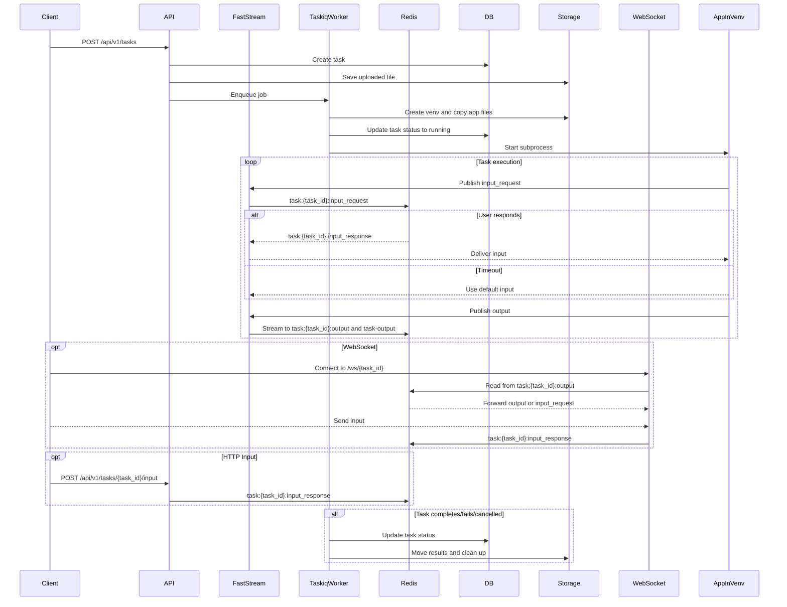

# Contributing to Waldiez Runner

Thank you for helping improve Waldiez Runner!

## 📚 Table of Contents

- [Development Setup](#development-setup)
- [Architecture](#architecture)
  - [Authentication](#authentication)
    - [Token Endpoints](#token-endpoints)
    - [WebSocket Authentication](#websocket-authentication)
  - [🔁 Redis I/O Layer: `RedisIOStream` an extension to ag2's IOStream](#-redis-io-layer-redisiostream-an-extension-to-ag2s-iostream)
  - [🧱 Output Streams](#-output-streams)
  - [🎤 Input Handling](#-input-handling)
  - [Message Format](#message-format)
  - [Smoke Test](#smoke-test)
  - [Formatting, Linting and Testing](#formatting-linting-and-testing)
  - [Roadmap](#roadmap)

## Development Setup

We currently support three development modes:

- Local (no Redis/Postgres required)
  Uses **FakeRedis** and **SQLite** for development and testing.

- `compose.dev.yaml` (Docker Compose)
  Standalone setup including:
  - Redis
  - PostgreSQL
  - Nginx (for reverse proxy or domain-based local dev)  
  Start with:

  ```shell
  docker compose -f compose.dev.yaml up --build
  ```

- `.devcontainer/` (VS Code)
  Runs Redis, PostgreSQL, and the API server in containers via [compose.yaml](./devcontainer/compose.yaml).

> [!TIP]
> If switching between a containerized environment and a local one, we should make sure the automatically generated (.gitignored) .env file has the correct hosts for the redis and db hosts and the boolean flags for enabling or not redis and postgresql. We can call `python3 scripts/toggle.py` (or `make toggle`) to toggle between the two environments. This will also update the .env file with the correct values.
>
> After cloning the repo, run pre-commit install to enable auto-formatting and smoke testing before each commit. Or use `make some` to run format, lint, toggle, and test in one go.
>
> Calling `make some` before committing will handle formatting, linting, toggling the dev environment, and testing (both pytest and the smoke test described below). If this won't work, we should manually check and modify the .env file to ensure the correct values are set.

## Architecture

Here's a high-level overview of the architecture:


### Authentication

We use local authentication with JWT tokens (oidc is also available but not tested).
There are two supported `audiences`:

- `clients-api`: To manage clients (for /api/v1/clients routes).
- `tasks-api`: To manage tasks (for /api/v1/tasks and /ws/{task_id} routes).

An initial client_id/client_secret (for the clients-api) pair is checked when the server starts (in the `initial_data.py` script). From there, you can create more clients to manage tasks.

#### Token Endpoints

- `/auth/token`: To get a JWT token. (POST, application/x-www-form-urlencoded):
  - `client_id`: The client_id.
  - `client_secret`: The client_secret.
  It returns a JWT token with the `aud` set to the client's audience:

  ```json
    {
        "access_token": "string",
        "refresh_token": "string",
        "token_type": "Bearer",
        "expires_at": "2025-03-21T09:39:10.383Z",
        "refresh_expires_at": "2025-03-21T09:39:10.383Z",
        "audience": "string"
    }
  ```

- `/auth/refresh`: To refresh a JWT token (POST, application/json):
  - `refresh_token`: The refresh token.
  - `audience`: The audience (optional, defaults to the current audience).
  It returns the same as the `/auth/token` route.

All the `/api/v1/*` routes require a valid JWT token in the `Authorization` header (Bearer token).

#### WebSocket Authentication

For websockets (`/ws/{task_id}`), we have the following ways to authenticate:

- Auth header: `{Authorization: Bearer <token>}`.
- Subprotocol: `task-api, <token>`.
- Cookie: `access_token`.
- Query parameter: `?access_token=<token>`

Ref: <https://websockets.readthedocs.io/en/stable/topics/authentication.html>

> [!TIP]
> Recommended: Auth header if available (Python client), subprotocol if not (JS client).

### 🔁 Redis I/O Layer: `RedisIOStream` an extension to ag2's [IOStream](https://github.com/ag2ai/ag2/blob/main/autogen/io/base.py#L63)

All task logs and input prompts/responses are handled through a custom `RedisIOStream` implementation.

This stream is used by the task runner inside its sandbox to communicate with the outside world via Redis.

### 🧱 Output Streams

- **Per-task stream**  
  Logs are written to:  
  `task:{task_id}:output`  
  This stream is ideal for scoped consumption, replay, and historical task views.

- **Shared stream**
  Logs are also written to:  
  `task-output`  
  This is a global stream for centralized consumers (e.g., a WebSocket router or dashboard component).

### 🎤 Input Handling

Two separate channels are used for input flow:

- Input request channel:   `task:{task_id}:input_request`
  - Published by the task when input is required
  - Consumed by WebSocket/UI or external tools

- Input response channel:  `task:{task_id}:input_response`
  - Published by WebSocket or HTTP clients with the user's input
  - Consumed by the task (which is waiting on the response)

### Message Format

All messages sent to either stream are JSON-encoded and follow this schema:

```json
{
  "type": "print | input_request | input_response",
  "task_id": "abc123",
  "timestamp": 1711210101210,
  "data": "message string or prompt",
  "request_id": "optional-uuid",
  "password": "optional flag (boolean) if input_request"
}
```

This supports:

- Filter logs by task
- Detect input prompts
- Track user responses
- Replay task flow

### Smoke Test

The script in [scripts/smoke.py](./scripts/smoke.py) is a simple smoke test to ensure the server is working as expected.

> [!TIP]
> It is recommended to run the server while a db and a redis container instance running (or using the .devcontainer in the project).
> Running the example in the host without redis and postgres might also work (we use FakeRedis and SQLite for testing),
> but pub/sub will probably trigger issues and real container instances are closer to the environment where the server will run.

All-in-one:

```shell
# if the test fails,
# you can enable logging of the services too (suppressed by default):
# python3 scripts/test.py --smoke --debug
make smoke
### or (what make smoke does):
# python3 scripts/test.py --smoke
### or (what the above does):
## ensures no processes of uvicorn or taskiq exist.
## runs pre-start checks and initial-data generation.
## starts all the services (uvicorn, taskiq broker, taskiq scheduler)
## in a background process:
## make dev-no-reload or make dev-no-reload-local [checks if in container to decide])
## in another foreground process:
## calls the smoke test script python3 scripts/smoke.py
```

Or manually:

First, ensure the server is running in dev mode:

```shell
make dev-no-reload
### or (what make dev-no-reload does):
### (pre-start checks for redis and postgres)
# python3 scripts/pre_start.py --no-force-ssl --redis --postgres --dev
### initial data (ensure the first client for the clients-api audience exists)
# python3 scripts/initial_data.py --redis --postgres --dev
### start the server in dev mode
# python3 -m waldiez_runner --trusted-origins http://localhost:3000,http://localhost:8000  --trusted-hosts localhost --debug --no-force-ssl --redis --postgres --dev
```

In another terminal (you may run it outside the container (e.g., on the host machine):

```shell
python3 scripts/smoke.py
```

The script will:

- Use the initial client_id/client_secret pair to get an access token.
- Ensure it cannot be used to list tasks (it is for clients only).
- Ensure it can be used to list and create clients.
- Generate one client and ensure it can be used to list tasks.
- Ensure the client cannot be used to list clients.
- Ensure the client can be used to list and create tasks.
- Generate one task and ensure it can be retrieved by id.
- Ensure the task status changes from pending to running.
- If the task is running, wait for it to complete.
- If the task is completed, download the archive.
- Ensure we cannot delete the client with the tasks access token.
- Ensure we can delete the client with the clients access token.
- Send Task input via HTTP.
- Run two parallel tasks (with input).

Not covered (yet?) in this script:

- Use the client in the package for the requests
- WebSocket connection for task input/output.

### Formatting, Linting and Testing

Before submitting any changes, try to ensure that the code is formatted, linted, and tested.

```shell
make clean && make format && make lint && make test
### or (what the above does):
### Remove cache and other unnecessary files
# python3 scripts/clean.py
### Format the code
# python3 scripts/format.py
### Lint the code
# python3 scripts/lint.py
### Run the tests
# python3 scripts/test.py
```

### Roadmap

- [x] Handle Local Authentication
- [x] Handle Task Creation
- [x] Handle Task Execution
- [x] Handle messaging between the task and the task broker to update the task status/results in db
- [ ] Documentation
- [x] Dockerfile/Containerfile generation
- [ ] Deployment examples and instructions:
  - [x] Docker Compose
  - [ ] Kubernetes
  - [ ] AWS ECS
  - [ ] GCP Cloud Run
- [ ] Example usage:
  - [x] An example using a JS client
  - [ ] An example using a python3 client (streamlit?)
- [ ] Support other storage backends (e.g., S3, GCS, etc.)
- [ ] Support other authentication methods (e.g., OIDC)
- [ ] Support three modes of operation:
  - [x] - Push Mode: Tasks are submitted via FastAPI (`POST /api/v1/tasks`), and execution is handled by TaskIQ workers.
  - [ ] Polling Mode: Workers periodically poll an external service to fetch jobs and execute them independently.
  - [ ] Hybrid Mode: Supports both push and polling mechanisms, allowing seamless fallback.
- [x] [Dev] work on any platform (Linux, MacOS, Windows) and any environment (containerized or not)
- [x] [Dev] Comprehensive tests for most parts. Coverage > 80%

Thank you for contributing! 🎉
