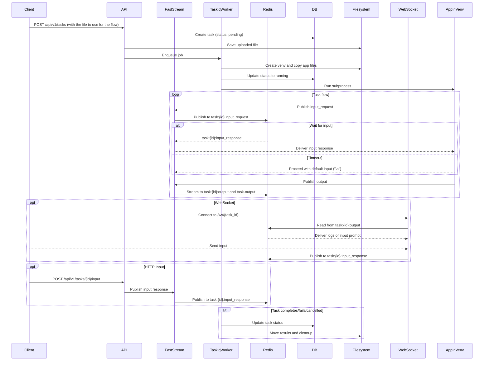

# Waldiez runner (server)

WIP/RFC

## Overview

A lightweight server to run tasks in isolated environments (e.g., Python virtualenvs) and stream logs and input/output via Redis.
Using:

- [Waldiez](https://github.com/waldiez/waldiez) + [ag2](https://github.com/ag2ai/ag2) + [FastStream](https://github.com/ag2ai/faststream) for running the isolated tasks.
- [FastAPI](https://fastapi.tiangolo.com/) for the API.
- [Taskiq](https://taskiq.readthedocs.io/en/latest/) for task management.
- [Redis](https://redis.io/) for streaming logs and input/output.
- [PostgreSQL](https://www.postgresql.org/) for task and client management.

## Design



## Status

- [x] Handle Local Authentication
- [x] Handle Task Creation
- [x] Handle Task Execution
- [ ] Handle messaging between the task and the server to update the task status/results in db
- [ ] Documentation
- [ ] Dockerfile and deployment generation
- [ ] Examples using a python client (streamlit?) and a JS client
- [ ] Support other storage backends (e.g., S3, GCS, etc.)
- [ ] Support other authentication methods (e.g., OIDC)
- [x] [Dev] work on any platform (Linux, MacOS, Windows) and in any environment (containerized or not)
- [ ] [Dev] Comprehensive tests for everything, reach coverage >= 80%

### Authentication

We use local authentication with JWT tokens (oidc is also available but not tested).
There are two supported `audiences`:

- `clients-api`: To manage clients (for /api/v1/clients routes).
- `tasks-api`: To manage tasks (for /api/v1/tasks and /ws/{task_id} routes).

An initial client_id/client_secret (for the clients-api) pair is checked when the server starts (in the `initial_data.py` script). From there, you can create more clients to manage tasks.

For local authentication, there are two routes:

- `/auth/token`: To get a JWT token. (POST, application/x-www-form-urlencoded):
  - `client_id`: The client_id.
  - `client_secret`: The client_secret.
  It returns a JWT token with the `aud` set to the client's audience:

  ```json
    {
        "access_token": "string",
        "refresh_token": "string",
        "token_type": "Bearer",
        "expires_at": "2025-03-21T09:39:10.383Z",
        "refresh_expires_at": "2025-03-21T09:39:10.383Z",
        "audience": "string"
    }
  ```

- `/auth/refresh`: To refresh a JWT token (POST, application/json):
  - `refresh_token`: The refresh token.
  - `audience`: The audience (optional, defaults to the current audience).
  It returns the same as the `/auth/token` route.

All the `/api/v1/*` routes require a valid JWT token in the `Authorization` header (Bearer token).

For websockets (`/ws/{task_id}`), we have the following ways to authenticate:

- Auth header: `{Authorization: Bearer <token>}`.
- Subprotocol: `task-api, <token>`.
- Cookie: `access_token`.
- Query parameter: `?access_token=<token>

Ref: <https://websockets.readthedocs.io/en/stable/topics/authentication.html>

> [!TIP]
> Recommended: Auth header if available (Python client), subprotocol if not (JS client).

### 🔁 Redis I/O Layer: `RedisIOStream` an extension to ag2's [IOStream](https://github.com/ag2ai/ag2/blob/main/autogen/io/base.py#L63).

All task logs and input prompts/responses are handled through a custom `RedisIOStream` implementation.

This stream is used by the app running inside each task’s virtual environment to communicate with the outside world — via Redis.

#### 🧱 Output Streams

- **Per-task stream**  
  Logs are written to:  
  `task:{task_id}:output`  
  This stream is ideal for scoped consumption, replay, and historical task views.

- **Shared stream**
  Logs are also written to:  
  `task-output`  
  This is a global stream for centralized consumers (e.g., a WebSocket router or dashboard component).

#### 🎤 Input Handling

Two separate channels are used for input flow:

- Input request channel:   `task:{task_id}:input_request`
  - Published by the task when input is required
  - Consumed by WebSocket/UI or external tools

- Input response channel:  `task:{task_id}:input_response`
  - Published by WebSocket or HTTP clients with the user's input
  - Consumed by the task (which is waiting on the response)

#### Message Format

All messages sent to either stream are JSON-encoded and follow this schema:

```json
{
  "type": "print | input_request | input_response",
  "task_id": "abc123",
  "timestamp": 1711210101210,
  "data": "message string or prompt",
  "request_id": "optional-uuid",
  "password": "optional if input_request"
}
```

This allows downstream consumers to:

- Filter logs by task
- Detect input prompts
- Track user responses
- Replay task flow

## Development

> [!TIP]
> We should `pre-commit install` to automatically call linting and smoke tests before any submission and avoid any ci failures.
> We sometimes forget to do this, but let's try to call it once we first clone the repo.

We provide a .devcontainer folder in the root of the project which can be used to run the server in a containerized environment. It includes a [compose.yaml](./.devcontainer/compose.yaml) file to run the server, a postgres database and a redis instance. This compose file is only for the development environment, and not for an actual deployment of the services. TODO: add a "deploy" folder with compose and k8s files for the deployment.

> [!TIP]
> If switching between a containerized environment and a local one, we should make sure the automatically generated (.gitignored) .env file has the correct hosts for the redis and db hosts and the boolean flags for enabling or not redis and postgresql. We can call `python scripts/toggle.py` (or `make toggle`) to toggle between the two environments. This will also update the .env file with the correct values.
> Calling `make some` before committing will handle formatting, linting, toggling the dev environment, and testing (both pytest and the smoke test described below). If this won't work, we should manually check and modify the .env file to ensure the correct values are set.

### Smoke Test

The script in [scripts/smoke.py](./scripts/smoke.py) is a simple smoke test to ensure the server is working as expected.

> [!TIP]
> It is recommended to run the server while a db and a redis container instance running (or using the .devcontainer in the project).
> Running the example in the host without redis and postgres will probably also work (we use FakeRedis and SQLite for testing),
> but real container instances are closer to the environment where the server will run.

All-in-one:

```shell
# if the test fails,
# you can enable logging of te services too (suppressed by default):
# python scripts/test.py --smoke --debug
make smoke
### or (what make smoke does):
# python scripts/test.py --smoke
### or (what the above does):
## ensures no processes of uvicorn or taskiq exist.
## runs pre-start checks and initial-data generation.
## starts all the services (uvicorn, taskiq broker, taskiq scheduler)
## in a background process:
## make dev-no-reload or make dev-no-reload-local [checks if in container to decide])
## in another foreground process:
## calls the smoke test script python scripts/smoke.py
```

Or manually:

First, ensure the server is running in dev mode:

```shell
make dev-no-reload
### or (what make dev-no-reload does):
### (pre-start checks for redis and postgres)
# python scripts/pre_start.py --no-force-ssl --redis --postgres --dev
### initial data (ensure the first client for the clients-api audience exists)
# python scripts/initial_data.py --redis --postgres --dev
### start the server in dev mode
# python -m waldiez_runner --trusted-origins http://localhost:3000,http://localhost:8000  --trusted-hosts localhost --debug --no-force-ssl --redis --postgres --dev
```

In another terminal (not necessarily in the container, you could use one on the host machine):

```shell
python scripts/smoke.py
```

The script will:

- Use the initial client_id/client_secret pair to get an access token.
- Ensure it cannot be used to list tasks (it is for clients only).
- Ensure it can be used to list and create clients.
- Generate one client and ensure it can be used to list tasks.
- Ensure the client cannot be used to list clients.
- Ensure the client can be used to list and create tasks.
- Generate one task and ensure it can be retrieved by id.
- Ensure the task status changes from pending to running.
- If the task is running, wait for it to complete.
- If the task is completed, download the archive.
- Ensure we cannot delete the client with the tasks access token.
- Ensure we can delete the client with the clients access token.

Not covered (yet?) in this script:

- WebSocket connection for task input/output.
- Task input via HTTP.

### Formatting, Linting and Testing

Before submitting any changes, make sure the linting and tests pass:

```shell
make clean && make format && make lint && make test
### or (what the above does):
### Remove cache and other unnecessary files
# python scripts/clean.py
### Format the code
# python scripts/format.py
### Lint the code
# python scripts/lint.py
### Run the tests
# python scripts/test.py
```

## License

This project is licensed under the [Apache License, Version 2.0 (Apache-2.0)](https://github.com/waldiez/vscode/blob/main/LICENSE).
