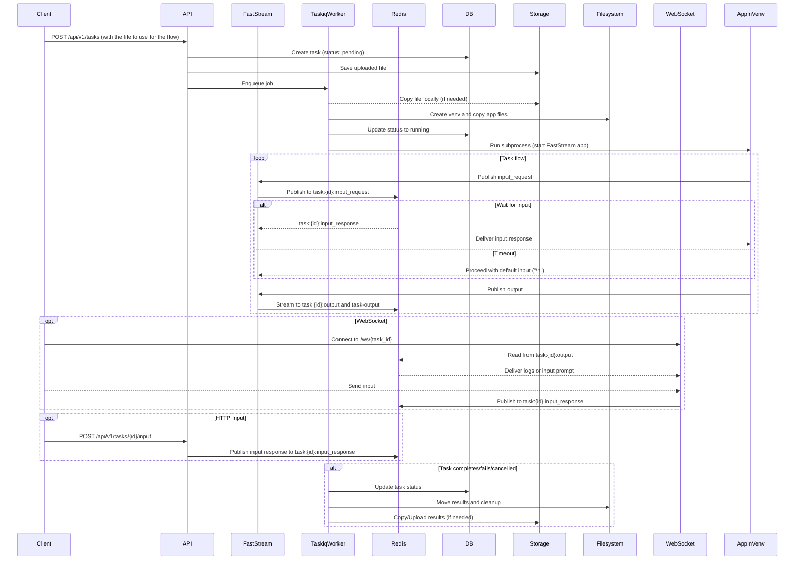

# Waldiez Runner

Run your [Waldiez](https://github.com/waldiez/waldiez) flows in isolated environments and stream logs/input/output via Redis.

## Overview

Waldiez Runner enables executing flows in isolated Python virtual environments or containers, with full I/O streaming via Redis and task management via FastAPI + Taskiq.

Backed by:

- [FastAPI](https://fastapi.tiangolo.com/) for the HTTP API
- [Taskiq](https://taskiq.readthedocs.io/) for async task queuing and scheduling
- [Redis](https://redis.io/) for messaging and log/input/output streaming
- [PostgreSQL](https://www.postgresql.org/) for tasks and clients persistence
- [Waldiez](https://github.com/waldiez/waldiez) + [ag2](https://github.com/ag2ai/ag2) + [FastStream](https://github.com/ag2ai/faststream)  
  for defining, executing, and streaming interactive flows in isolation

## Architecture

## License

This project is licensed under the [Apache License, Version 2.0 (Apache-2.0)](https://github.com/waldiez/vscode/blob/main/LICENSE).
