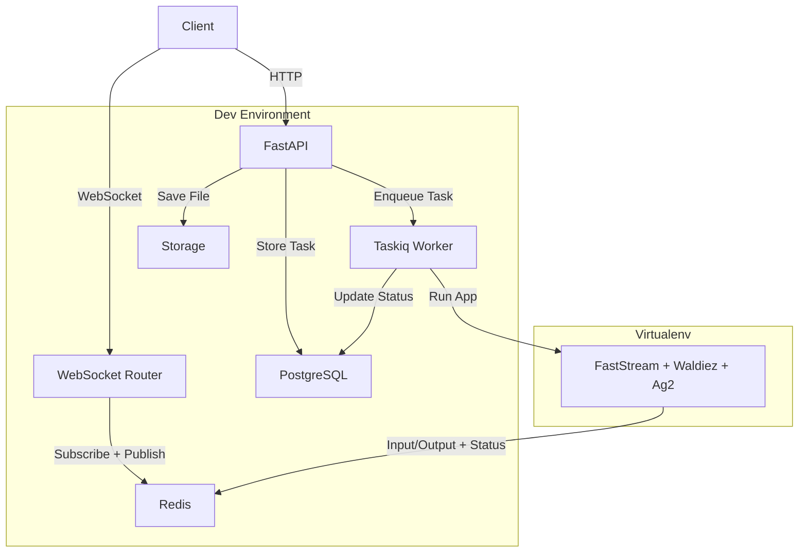
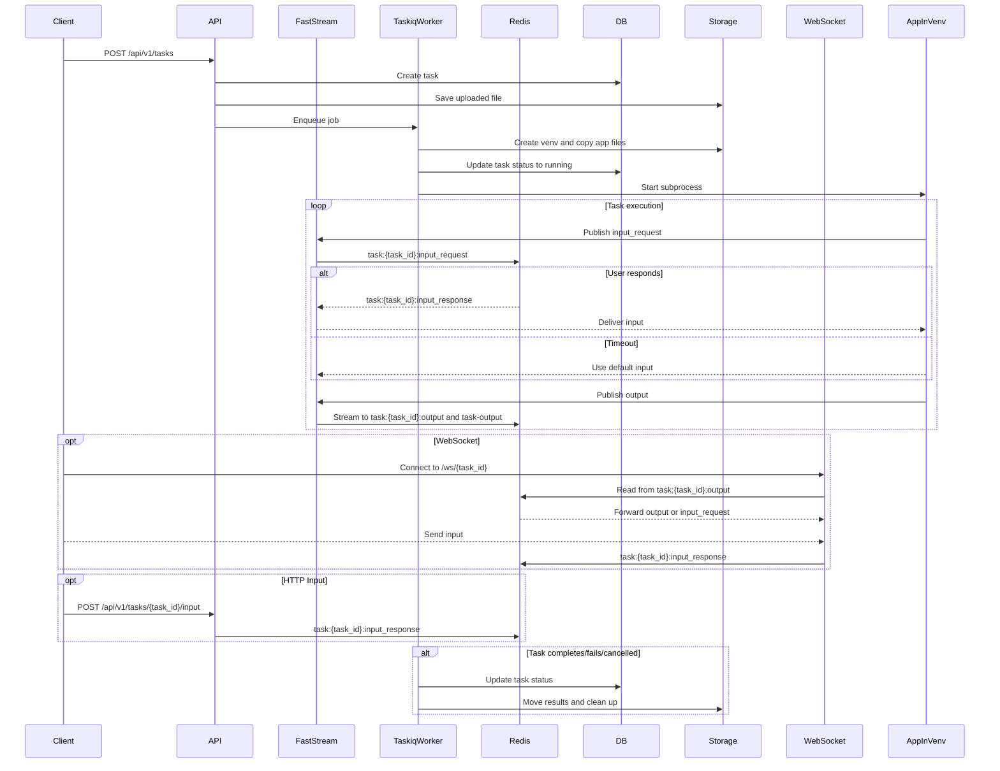

# Architecture

Waldiez Runner orchestrates the execution of [Waldiez](https://github.com/waldiez/waldiez) flows in isolated environments (e.g. virtualenvs), with full support for live input/output streaming and task management via HTTP or WebSocket.

It uses a modular architecture composed of:

| Component     | Description |
|---------------|-------------|
| **FastAPI**   | HTTP API for tasks, inputs, clients, and authentication |
| **Taskiq**    | Asynchronous job runner (background task execution) |
| **FastStream** | Executes uploaded app in a new virtualenv |
| **Redis**     | Handles message passing (logs, prompts, responses) |
| **PostgreSQL**| Persists task and client state |
| **WebSocket** | Real-time input/output interface for tasks |

## System Overview

## Redis I/O and Status Channels

Tasks use `RedisIOStream` an extension to ag2's [IOStream](https://github.com/ag2ai/ag2/blob/main/autogen/io/base.py#L63) to stream logs and request input. This includes:

- Output:
  - `task:{task_id}:output`: per-task stream
  - `task-output`: global stream for all task messages
- Input:
  - `task:{task_id}:input_request`: prompt user input
  - `task:{task_id}:input_response`: receive user reply
- Control:
  - t`ask:{task_id}:status`: used by the runner to react to cancel requests and broadcast lifecycle events (running, completed, failed, etc.)

## Execution Flow

The diagram below illustrates how the system handles a full task lifecycle — from submission to completion.

