Waldiez Runner uses a modular, event-driven orchestration architecture to execute multi-agent ([Waldiez](https://github.com/waldiez/waldiez)) flows in isolated environments (e.g. virtualenvs) with real-time input/output via Redis and WebSocket. It is composed of several components that work together to manage task execution, input/output handling, and result storage:

| Component      | Description                                             |
|----------------|---------------------------------------------------------|
| **FastAPI**    | HTTP API for tasks, inputs, clients, and authentication |
| **Taskiq**     | Asynchronous job runner (background task execution)     |
| **FastStream** | Executes uploaded app in a new virtualenv               |
| **Redis**      | Handles message passing (logs, prompts, responses)      |
| **PostgreSQL** | Persists task and client state                          |
| **WebSocket**  | Real-time input/output interface for tasks              |

## System Overview

```mermaid
graph TD
  %% ========== Client ==========
  Client["🧑‍💻 Client <br>(Web / Python / CLI)"] -->|POST /tasks| FastAPI["🚀 FastAPI <br>(REST API)"]
  Client -->|"WebSocket /ws/{task_id}"| WebSocket["🔌 WebSocket Endpoint"]

  %% ========== Task Triggering ==========
  FastAPI -->|Save .waldiez| Storage["📁 Storage"]
  FastAPI -->|Create Task| DB["🗃️ PostgreSQL"]
  FastAPI -->|Enqueue Job| Redis["📨 Redis <br>(Broker)"]

  Redis --> Taskiq["⚙️ Taskiq Worker"]

  %% ========== Task Execution ==========
  Taskiq --> |Setup venv + prepare app| FastStream["⚡ FastStream App"]
  FastStream -->|Load flow| Waldiez["🧠 Waldiez <br>flow parser"]
  Waldiez -->|Generate agents + code| AG2["🧬 AG2 Execution"]

  AG2<-->|Print + Input| RedisIO["📡 Redis <br>(Streams + PubSub)"]

  %% ========== WebSocket Interaction ==========
  WebSocket <-->|Listen + respond to I/O| RedisIO

  %% ========== Results Handling ==========
  FastStream -->|Send results| RedisResults["📨 Redis <br>(Results backend)"]
  Taskiq -->|Fetch results| RedisResults
  Taskiq -->|Save results| DB
  Taskiq -->|Upload outputs| Storage
  Taskiq -->|Cleanup venv| Cleanup["🧹 Cleanup"]

  %% ========== Groupings ==========
  subgraph "API Layer"
    FastAPI
    WebSocket
  end

  subgraph "Task Manager"
    Taskiq
    Redis
    RedisResults
    DB
    Storage
    Cleanup
  end

  subgraph "Execution (Virtualenv)"
    RedisIO
    FastStream
    Waldiez
    AG2
  end
```

!!! Note
    All Redis roles (task broker, result backend, and I/O streams) are within the same Redis container. The roles are separated for clarity and distinction:

    1. 🔁 Task Broker (via Redis Queue):
       - Used by FastAPI & Taskiq for job queueing.
    2. 🧠 Result Backend:
       - FastStream pushes final results here for Taskiq to fetch.
    3. 📡 PubSub & Streams:
       - Real-time I/O (prints + input requests) between AG2 ↔ WebSocket.

## Redis I/O and Status Channels

Tasks use `RedisIOStream` an extension to ag2's [IOStream](https://github.com/ag2ai/ag2/blob/main/autogen/io/base.py#L63) to stream logs and request input. This includes:

- Output:
  - `task:{task_id}:output`: per-task stream
  - `task-output`: global stream for all task messages
- Input:
  - `task:{task_id}:input_request`: prompt user input
  - `task:{task_id}:input_response`: receive user reply
- Control:
  - `task:{task_id}:status`: used by the runner to react to cancel requests and broadcast lifecycle events (running, completed, failed, etc.)

## Execution Flow

The diagram below illustrates how the system handles a full task lifecycle — from submission to completion.

