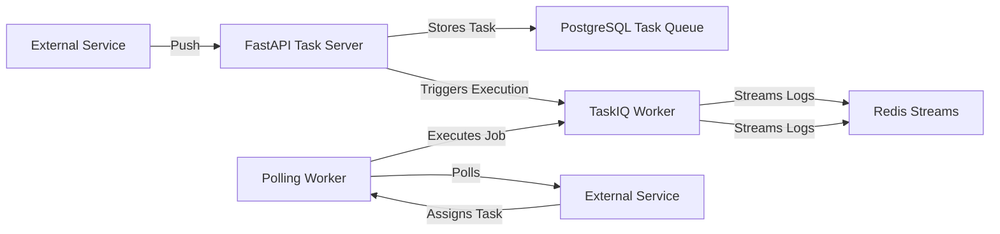
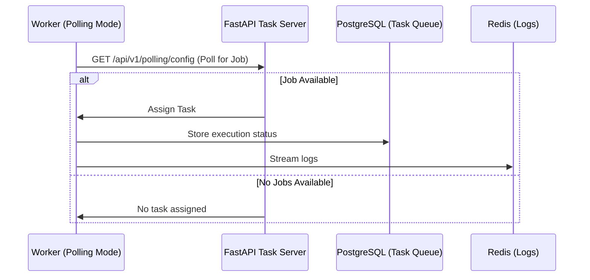

# 🚀 Multi-mode Task Execution System (Push, Polling & Hybrid Modes)

## 📌 Introduction

Support for:

- **Push Mode**: Tasks are submitted via FastAPI (`POST /api/v1/tasks`), and execution is handled by TaskIQ workers.
- **Polling Mode**: Workers periodically poll an external service to fetch jobs and execute them independently.
- **Hybrid Mode**: Supports both push and polling mechanisms, allowing seamless fallback.

This system is **configurable**, allowing any of the three modes.



---

## 📡 Push Mode: FastAPI-Initiated Execution

### 🔧 Key Features

- **All requests (except `/health`) require authentication** (JWT-based).
- **Tasks are submitted via API** (`POST /api/v1/tasks`).
- **Tasks are stored in PostgreSQL**.
- **Execution is managed by TaskIQ workers**.
- **Logs are streamed via Redis**.
- **Supports WebSockets for real-time task monitoring & input handling**.

### 📌 Endpoints (Push Mode)

| Method   | Endpoint                           | Description                                             |
|----------|------------------------------------|---------------------------------------------------------|
| `POST`   | `/api/v1/tasks`                    | Submit a task (only allowed for push-mode workers).     |
| `GET`    | `/api/v1/tasks/{task_id}`          | Retrieve task details.                                  |
| `GET`    | `/api/v1/tasks/{task_id}/download` | Fetch generated task output.                            |
| `POST`   | `/api/v1/tasks/{task_id}/cancel`   | Cancel a running task.                                  |
| `DELETE` | `/api/v1/tasks/{task_id}`          | Delete a task (`?force=true` also deletes active ones). |

📌 **Push-mode workers execute tasks immediately upon submission.**

---

## 📡 Polling Mode: Worker-Initiated Execution

### 🔧 Polling mode Features

- **Workers periodically poll the API for new jobs** (`GET /api/v1/polling/config`).
- **If a task exists, it is assigned to the polling worker**.
- **Worker executes the task independently.**
- **Worker streams logs to Redis (same as push mode).**
- **Workers must be registered using `POST /api/v1/polling/register` before polling.**
- **Polling workers can dynamically configure themselves using `/api/v1/polling/config`.**

### 📌 Polling Workflow



### 📌 Polling Mode Endpoints

| Method | Endpoint                          | Description                              |
|--------|-----------------------------------|------------------------------------------|
| `GET`  | `/api/v1/polling/config`          | Retrieve polling worker configuration.   |
| `GET`  | `/api/v1/polling/config/statuses` | Retrieve valid job statuses.             |
| `POST` | `/api/v1/polling/register`        | Register a new polling worker.           |
| `POST` | `/api/v1/polling/update`          | Worker updates job status.               |
| `POST` | `/api/v1/polling/revoke`          | Admin revokes a polling worker.          |
|        | `/api/v1/polling/ws`              | WebSocket for real-time job assignments. |

---

## 🎛 Task Assignment Modes

| Mode             | Description                                                                    |
|------------------|--------------------------------------------------------------------------------|
| **Push Mode**    | Tasks are submitted to FastAPI (`POST /api/v1/tasks`) and executed via TaskIQ. |
| **Polling Mode** | Workers poll an external service for tasks and execute them independently.     |
| **Hybrid Mode**  | Both modes are enabled, allowing task submission via API or polling.           |

### 🔧 Configuration

```ini
TASK_ASSIGNMENT_MODE=hybrid  # Options: "push", "polling", "hybrid"
```

---

## 🔐 Authentication

### Modes of Authentication

1️⃣ **Push Mode (JWT-based)**

- Uses HS256 tokens for internal API security.
- Supports `/token` & `/token/refresh` endpoints.

2️⃣ **Polling Mode (Worker Token)**

- Workers authenticate using **long-lived `worker_token`**.
- Token is assigned **upon registration** and stored in the `workers` table.

---

## 📡 Worker Discovery (`GET /api/v1/polling/config`)

Polling workers can **dynamically configure themselves** by retrieving this configuration file.

### 📌 Example Response

```json
{
  "registration_url": "https://api.example.com/api/v1/polling/register",
  "polling_url": "https://api.example.com/api/v1/polling/config",
  "job_update_url": "https://api.example.com/api/v1/polling/update",
  "status_schema_url": "https://api.example.com/api/v1/polling/config/statuses",
  "authentication": {
    "method": "bearer_token",
    "header": "Authorization",
    "prefix": "Bearer"
  },
  "job_response_template": {
    "task_id": "task-789",
    "payload": {
      "job_type": "image-processing",
      "input_url": "https://example.com/image.jpg"
    }
  }
}
```

📌 **Workers should fetch this periodically to detect configuration changes.**
